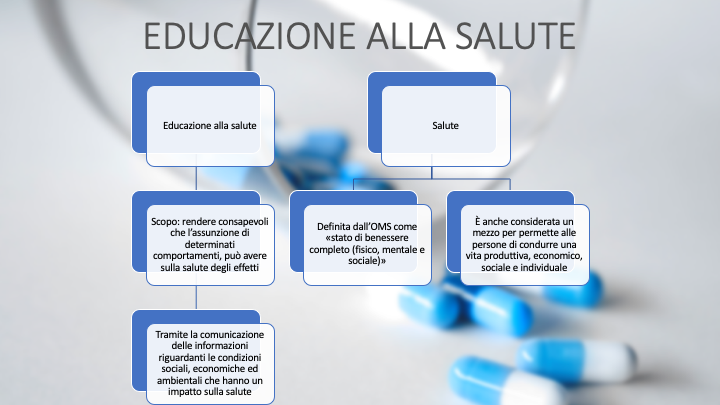

# Le scienze motorie e i diversi tipi di educazioni alla convivenza civile

## Power Point

## Bibliografia e sitografia

### Bibliografia

- “In movimento”, Gianluigi Fiorini, Stefano Coretti, Silvia Bocchi

### Sitografia

- <https://istruzione.it>
- <https://educazionestradale.it>
- <https://miur.gov.it>
- <https://alberghierolaspezia.edu.it>
- <https://who.int>
- <https://my-personaltrainer.it>

::: tip Grazie per l’attenzione

Basso Daniele, Falzarano Pier Paolo, Santin Giulia, Tombolan Fabrizio

:::
