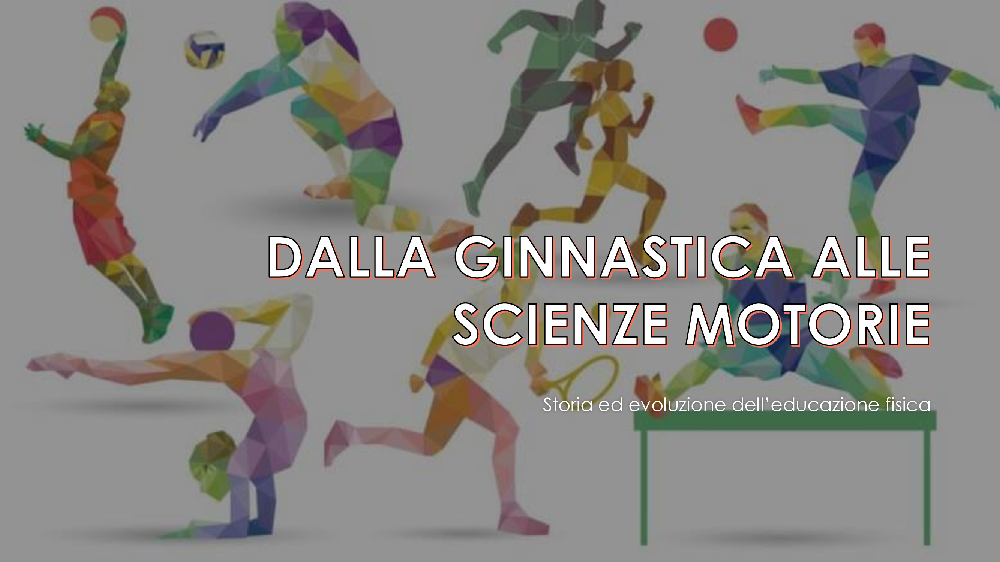
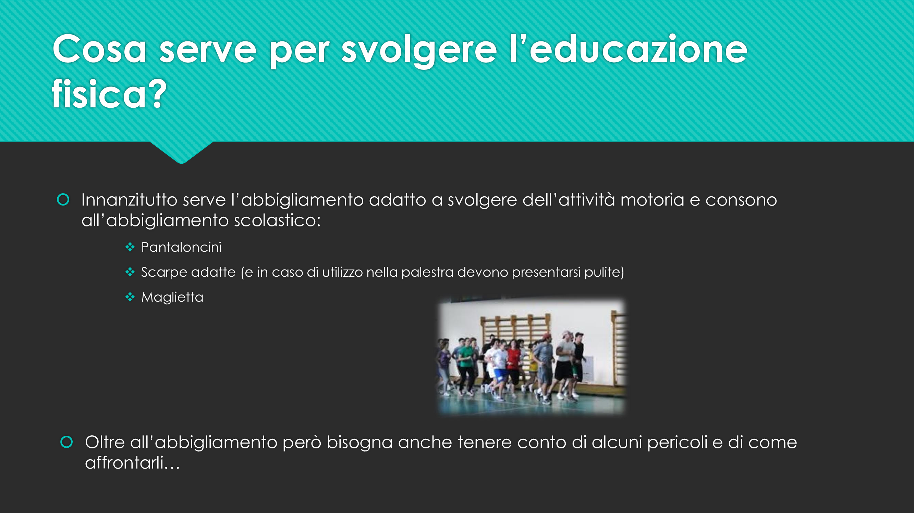
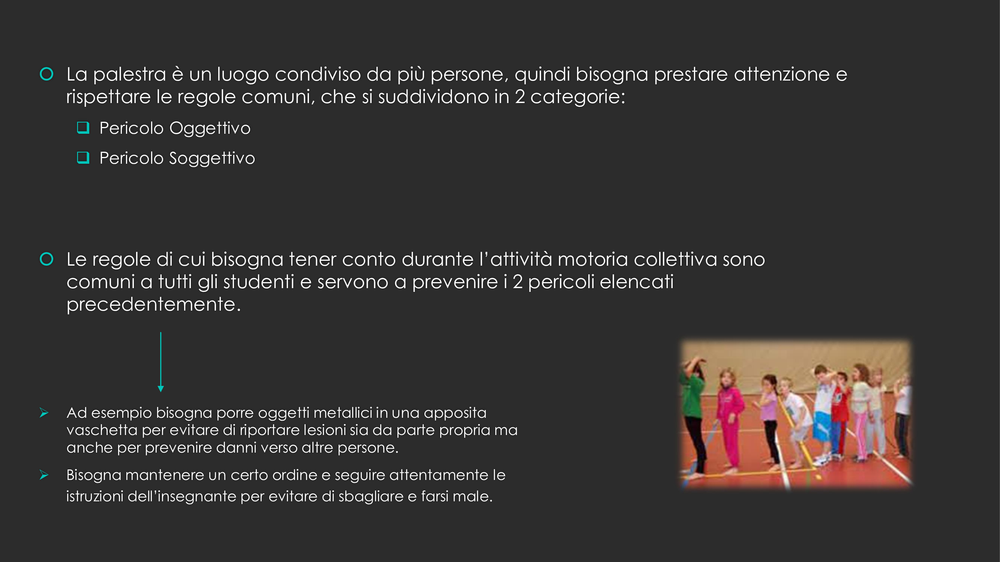
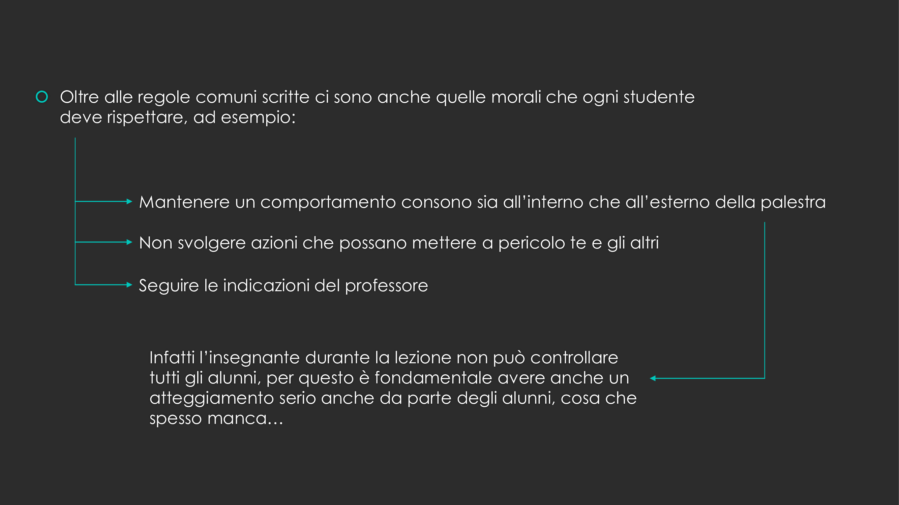
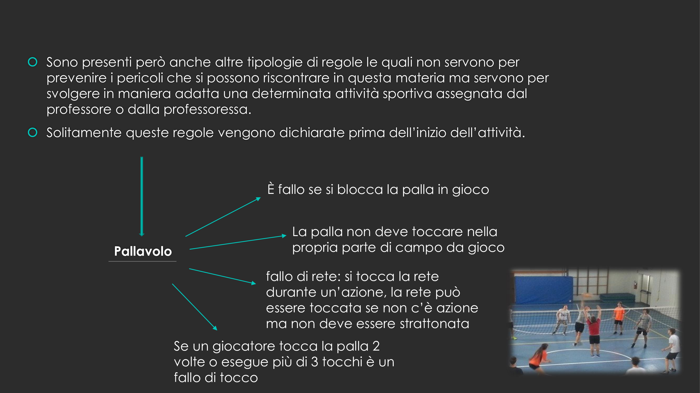

# Dalla ginnastica alle scienze motorie

## Power Point

## Bibliografia e sitografia

### Bibliografia

- Fiorini G. ; Coretti S. ; Bocchi S. ; in Movimento ; 1ª edizione: febbraio 2010 ; Trebaseleghe (PD); De Agostini Scuola SpA

### Sitografia

- <https://it.wikipedia.org/>
- <https://unsaltoneltempo.jimdofree.com/>
- <https://giuseppesibilani.jimdofree.com/>
- <https://salvovecchioscienzemotorie.blogspot.com/>
- <https://www.quotidiano.net/>
- <https://beeclimber.com/>
- <http://www.liceopeano.it/>
- <https://www.istitutofreud.it/>
- <https://www.icnicodemifiscianocalvanico.it/>
- <https://www.icbelgioioso.edu.it/>
