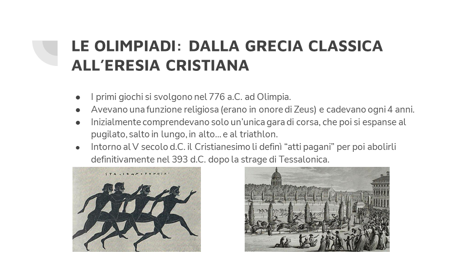
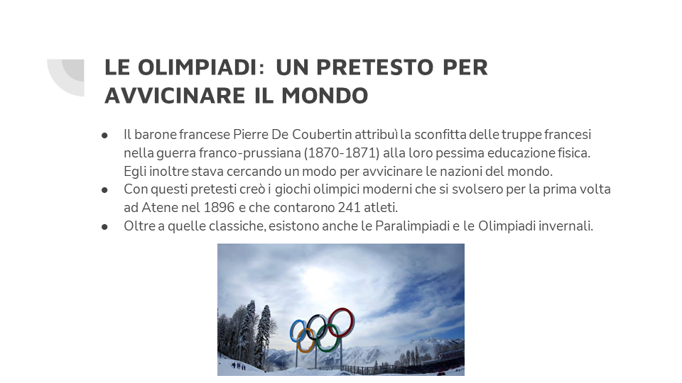

# Le Olimpiadi, la Bandiera a 5 cerchi e il fair play

## Power Point

## Bibliografia e sitografia

- Storia delle Olimpiad e cerimonialei: https://it.wikipedia.org/wiki/Giochi_olimpici
- Paralimpiadi: https://corriereitalianita.ch/storia-delle-paralimpiadi/
- Olimpiadi invernali: https://www.sportmondo.it/storia-olimpiadi-invernali
- Fair Play: https://it.wikipedia.org/wiki/Fair_play_(comportamento)
- Luiz Long e Jesse Owens: http://www.storiedisport.it/?p=8910
- Storia della bandiera olimpica: https://www.focus.it/cultura/storia/cosa-rappresentano-i-cerchi-olimpici

::: tip Grazie per l’attenzione

Bottosso Edoardo, Casagrande Michele, Fusina Alberto, Iannicelli Edoardo, Zanette Martina

:::
