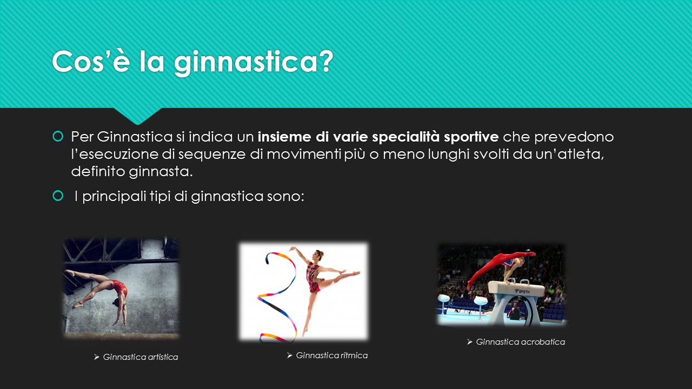
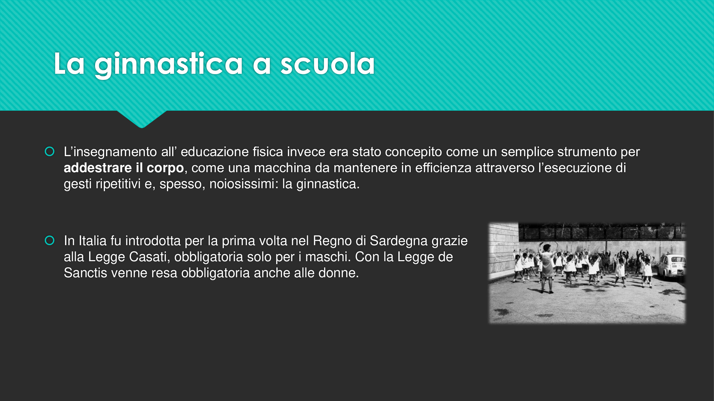
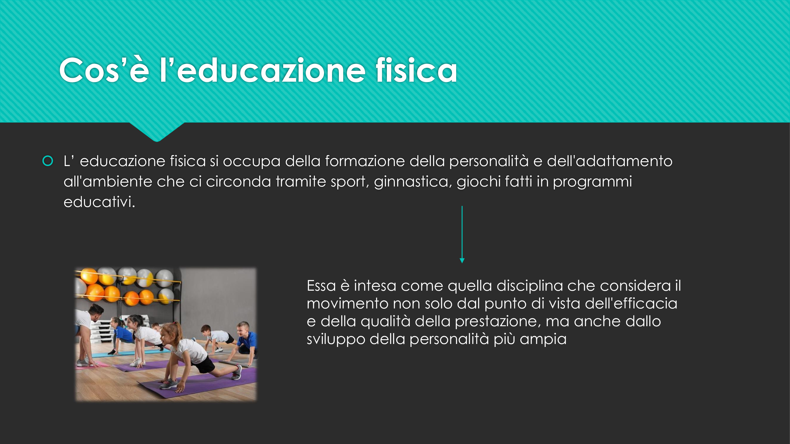
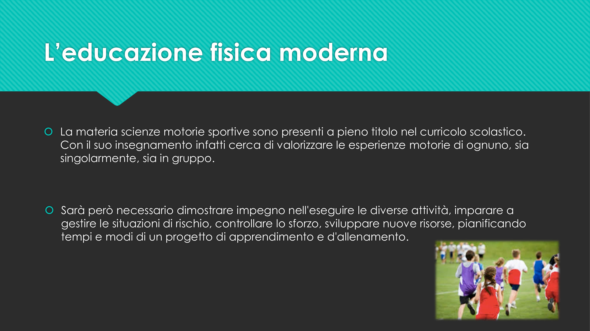
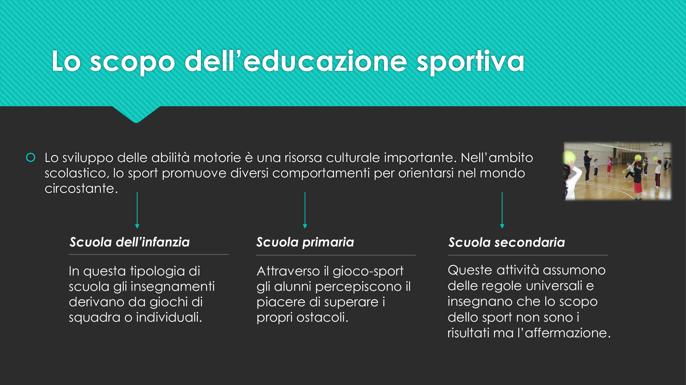
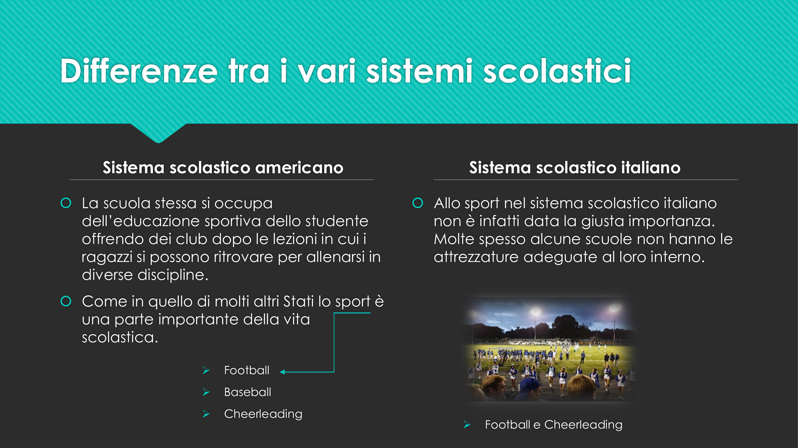
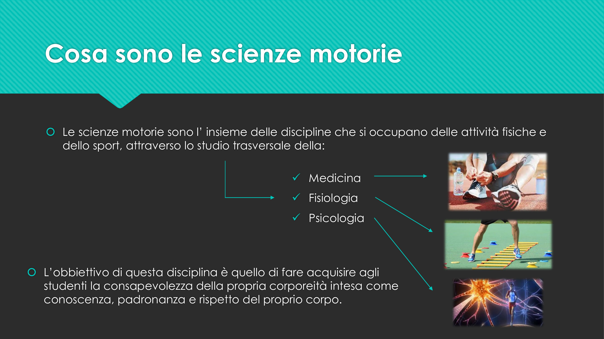
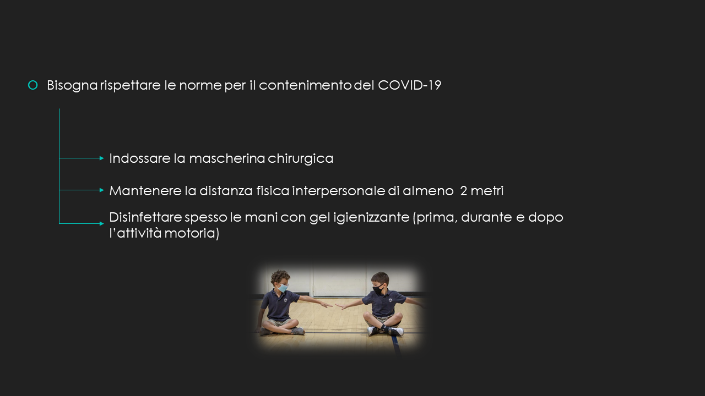

# Responsabilità individuali e collettive, il valore delle regole

## Power Point

## Bibliografia e sitografia

### Responsabilità individuale e collettiva

- <https://www.alessandrochelo.com>
- <https://www.brocardi.it>
- <https://www.studiolegaleliguori.com>
- <https://it.linkedin.com>
- <https://www.centropromozionelegalita.it>

### Sport Individuali e di squadra

- <https://www.anasitalia.org>
- <https://www.greenhousesport.it>
- <https://www.stateofmind.it>
- <https://www.unvs.it>
- <https://www.cuscosenza.it>

### Covid

- <https://www.linchiestaquotidiano.it>
- <https://www.left.it>
- <https://www.mondadorieducation.it> (articolo di Stefania Franco, Immunità: scelta individuale, responsabilità collettiva)
- <https://ilbolive.unipd.it/> (articolo di Valerio Calzolaio, Covid-19, libertà di movimento ed etica della responsabilità)
- <https://www.urbanit.it> (articolo di Elena Pede, Vivere l’incertezza: responsabilità individuale e società del rischio)

### Valore delle regole, comportamento sportivo e Capacità di giudizio

- Il Movimento di S. Bocchi, S. Coretti, G. Fiorini, (edito da Marietti Scuola)

::: tip Grazie per l’attenzione

Ceccon Marco, Furlan Cristiano, Gerolami Anthony, Menegon Marco, Vendramini Riccardo

:::
