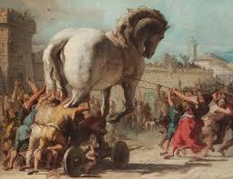

# Il cavallo di legno e l'ultima notte di Troia

[[toc]]

## Riassunto

Il narratore del testo è Enea che racconta a Didone, regina di Cartagine, della tragica ultima notte di Troia, dall’arrivo fuori dalle mura del cavallo alle fiamme che distruggeranno la città. 

## Struttura del testo 
- `Proemio`
  Da riga 1 `Tacquero tutti […]` a riga 13 `[…] , comincerò.`
- La decisione sul destino del cavallo
  Da riga 14 a riga 40
- Il disaccordo di Lacoonte
  Da riga 41 `Stremati dalla guerra […]` a 57 `[…], dureresti ancora`
- Una morte teatrale
  Da riga 199 `Qui un nuovo avvenimento […]` a riga 227 `[…] sotto il cerchio dello scudo.`
- Il cavallo entra in città
  Da riga 228 `Allora a tutti s’insinua[…]` a riga 247 `[…] creduta dai teucri.`
- La distruzione di Troia
  Da riga 248 `Noi sventurati, […]` a riga 267 `[…] congiungono le complici schiere.` 

## Commento del brano
 
Il testo narra la tragica fine di Troia, voluta dal Fato e inevitabile. Essa provoca in Enea un grande dolore anche dal momento che coglie di sorpresa gran parte dei Troiani, che avevano creduto alla ritirata del Greci e nel dono del cavallo `[…] Mi chiedi, o regina ,di rinnovare un dolore indicibile […].` Ma è il Fato stesso che vuole così: ha già stabilito la caduta di Troia e a nulla può servire l'opposizione del sacerdote Laocoonte, che ha compreso la cruda verità.

Inoltre la distruzione della città dipende dall'inganno: paradossalmente, il luogo in cui gli eroi si erano a lungo scontrati nel rigoroso rispetto del codice eroico, cade per un'ingegnosa macchinazione, frutto dell'astuzia di Ulisse e dello scaltro Sinone.

Il racconto è reso tale grazie alle tecniche di narrazione utilizzate da Virgilio.

Ad esempio con la tecnica del flashback è possibile avere una rilettura sentimentale del racconto, in questo caso dalla prospettiva personale di Enea. Oppure durante il discorso di Laocoonte viene utilizzato il discorso diretto, che conferisce maggiore drammaticità alla scena.

## Personaggi

- **Enea**: figlio di Anchise e della dea greca Venere. È sposato con Creusa e i due hanno anche un figlio chiamato Ascanio. Egli inoltre diventa famoso per essere sopravvissuto per sette anni in mare nonostante Giunone, che odiava lui e tutti gli altri troiani, cercherà di rendergli impossibile il viaggio. In questo brano svolge il ruolo di narratore interno e viene evidenziato soprattutto il suo dolore nel ricordare e raccontare il terribile evento. 
- **Laocoonte**: è un veggente e sacerdote di Poseidone; ha due figli di nome Timbreo ed Antifate. Quando a Troia si presenta il cavallo di legno è tra i più determinati a rifiutare l’accesso alle mura di quest’ultimo poiché non crede che i greci possano aver fatto un dono ai troiani. La sua convinzione è talmente tanta che scaglia una lancia contro il ventre della statua, rivelando che essa è vuota al suo interno, ma nessuno gli da peso. Sarà la sua determinazione a portarlo alla morte insieme ai figli per mano di Porcete e Caribea, due serpenti marini inviati da Atena, che sosteneva i greci nella loro impresa.
- **Sinone**: è un infiltrato mandato dai greci. Grazie ad una finta storia secondo la quale lui era fuggito da Ulisse riesce a convincere il Re Priamo a portare il cavallo all’interno della città. Inoltre sarà lui ad aprire il ventre della statua in legno facendo entrare i suoi compagni a Troia.
- **I troiani**: dall’apparizione del cavallo la popolazione si dimostra divisa su chi sostiene il pensiero di Laocoonte e chi pensa il contrario e vorrebbe farlo entrare. Dopo la morte del sacerdote molti abitanti, pensando che questo fatto sia un avvertimento divino, si mostreranno favorevoli all’accesso del dono greco. A causa di questa loro ingenuità la città poco dopo verrà rasa al suolo. 
- **I greci (Danai)**: coloro che, guidati da Ulisse e altri guerrieri ,entreranno a Troia e daranno inizio al massacro di quest’ultima.

## Spazio e tempo

- **Spiaggia**: è un luogo aperto che indica sia l’apparente fine della guerra che ha infestato Troia per decenni sia il ritrovamento del cavallo di legno. Questo spazio richiama alla gloria e alla soddisfazione per la vittoria del conflitto `[…] Allora tutta la Teucria si scioglie da un lungo dolore […]`, ma allo stesso tempo porta ad una miriade di dubbi sul da farsi riguardo al dono dei greci. Inoltre qui troveranno la morte  Laocoonte e i suoi due figli per mano dei serpenti inviati da Atena.
- **Troia**: La sfarzosa città che tutti conosciamo, vittima dell’ingenuità delle genti che hanno permesso l’accesso al cavallo di legno. Durante la festa si presenta come un luogo allegro, sereno e privo di ogni preoccupazione; un lusso tipico di un popolo che è appena uscito da una guerra logorante durata decenni. Purtroppo poi, in seguito all’attacco dei greci, la situazione tramuterà: l’ambiente si tingerà di orrore, paura e pentimento, dovuto dall’ingenuità della popolazione favorevole all’accesso all’interno delle mura di quello che doveva essere il dono che avrebbe segnato la fine della guerra.

## Riferimenti artistici

Questo passo dell’Eneide è molto famoso, tanto che su quest’ultimo sono state fatte numerose opere artistiche. Degno di nota è il gruppo statuario scolpito da Agesandro, Polidoro e Atanodoro, chiamato "Laocoonte". Come suggerisce il nome l'opera rappresenta la tragica scena in cui il sacerdote troiano e i suoi due figli vengono trucidati dai due serpenti inviati dagli dei. Attualmente questa statua è conservata nei Musei vaticani.

Un'altra opera da citare è sicuramente quella del pittore italiano Fabrizio Clerici "Il recupero del cavallo di Troia", ovvero un dipinto raffigurante quella che dovrebbe essere la testa del famoso cavallo su una scogliera.

A livello cinematografico invece sono stati girati molti film che racconto fedelmente, chi più chi meno, le vicende della guerra di Troia. Noi abbiamo inserito "Troy", il famosissimo cortometraggio che vede attori del calibro di Brad Pitt e Orlando Bloom.

