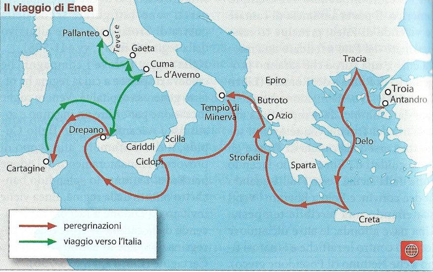

# La trama dell'Eneide

[[toc]]

## Libro I

La  storia comincia dopo sette anni dalla distruzione della città di Troia; in questo momento la dea Giunone scatena su Enea e i suoi compagni una tempesta, che li costringe ad approdare in Libia vicino a Cartagine, dove governa la regina Didone.
Enea viene accolto dalla regina con un banchetto, durante il quale Didone chiede a quest’ultimo di raccontare la sua storia.

## Libro II

Enea narra della caduta di Troia della fuga dalla città con il figlio Ascanio e il padre Anchise, e della perdita di sua moglie Creusa.

## Libro III

Dopo aver costruito una flotta di navi Enea salpa verso la Tracia, dove vuole fondare una nuova città. È in questo luogo che Enea, mentre raccoglie dei ramoscelli, trova Polidoro, figlio di Priamo, il quale racconta che il re della regione lo ha tradito. Enea decide quindi di abbandonare la nuova terra e di dirigersi verso Delo, dove andrà dall'oracolo di Apollo, che gli svela il destino di dover fondare una nuova città e una nuova stirpe, cercando “l'antica madre”. Enea si dirigerà verso l'isola di Creta, la terra natale di Teucro, il capostipite dei troiani. Arrivato a Creta,  ad Enea appariranno in sogno i penati, protettori della famiglia, i quali gli indicheranno l'Italia come l'antica madre.
Dirigendosi verso l'Italia, i Troiani vengono colpiti da una tempesta che li fa naufragare sulle isole Strofadi, dove risiedono le arpie. Si dirigono poi ad Azio e nell'Epiro, proseguendo poi verso Drepano, dove morirà Anchise.

## Libro IV

Didone è innamorata di Enea, la quale confessa questo sentimento alla sorella Anna. Le dee Giunone e Venere decidono di favorire la loro unione, ma il dio Mercurio va da Enea per ricordargli della sua missione. Enea prepara in segreto la sua flotta per salpare, quando Didone lo scopre, cerca di fare rimanere Enea con lei, ma non riuscendoci si uccide.

## Libro V

I troiani arrivano in Sicilia; qui Giunone istiga le donne stanche del vagare per mare, a bruciare le navi.

## Libro VI

Arrivato a Cuma, Enea incontra Sibilla che lo guida nell'Ade. Qui Enea incontra Didone e suo padre.

## Libro VII

I troiani sbarcano nel Lazio, vicino alla foce del Tevere, qui Enea capisce che è arrivato alla meta. Una volta accolto dal re Latino, viene promesso in matrimonio alla figlia Lavinia.
La moglie di Latino però, avversa alle idee del marito, voleva far sposare Lavinia con suo cugino Turno, re di uno Stato vicino.

## Libro VIII

Enea si allea con il re Evandro, il quale gli affida un contingente militare.
La dea Venere chiede a Vulcano di fornire all'eroe uno scudo, su cui vengono raffigurati momenti della storia romana.

## Libro IX

Mentre Turno attacca i troiani, Eurialo e Niso, due amici di Enea, escono dal campo per avvertire l’eroe dell'attacco, rimanendone uccisi.

## Libro X

Enea torna e i combattimenti continuano, ma molti giovani troiani e latini vengono uccisi.

## Libro XI

I due schieramenti si accordano in una tregua per seppellire i caduti dopo una grande battaglia.

## Libro XII

Turno sfida Enea a duello.
Venere e Giunone si accordano per unire i due popoli con nome ed usanze latine.
Enea, in un momento d'ira uccide Turno.

