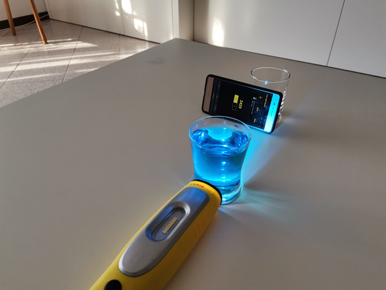
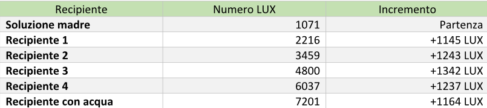
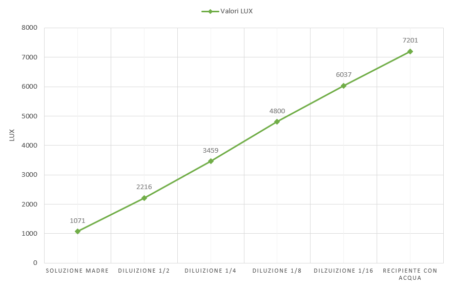

# Esperimento sulle Diluizioni

## Obiettivo

L’obiettivo di questo esperimento è osservare le variazioni (colore, numero di LUX) che si vengono a formare tra 4 recipienti con una soluzioni diluite, una soluzione madre e un recipiente contenente acqua.

## Materiali

- 6 recipienti trasparenti
- Colorante (preferibilmente blu)
- Acqua (preferibilmente distillata)
- Pipetta
- Superficie bianca (per fare le osservazioni)
- Torcia
- Telefono
    - app per leggere i LUX
- Pennarello

## Procedimento

1.  Porre tutti i materiali sulla superficie vianca e prendere il primo recipiente
2.  Segnare il volume massimo e la metà di esso in ogni bicchiere
3.  Preparare la soluzione madre nel primo recipiente aggiungendo 10 goccie di colorante con la pipetta
4.  Ora portare a volume aggiungendo acqua  
5.  Adesso bisogna prendere metà della soluzione madre appena preparata e passarla sul secondo recipiente. Successivamente portare a volume così da ottenere una soluzione più diluita
6. Ripetere l'operazione per tutti i bicchieri tranne l'ultimo nel quale bisogna disporre solo acqua
7. Ora porre ciascun recipiente tra il telefono e la torcia (puntata sul bicchiere) e raccogliere i dati.
8. Posizionare i contenitori dalla soluzione madre alla più diluita (acqua) ed osservare.

## Foto esperimento

- ###### soluzione madre

- ###### soluzione diluita 1 / 2

- ###### soluzione diluita 1 / 8

- ###### soluzione diluita 1 / 4

- ###### soluzione più diluita

- ###### recipiente con acqua

## Foto recipienti

## Raccolta ed elaborazione dati

- La media dell’incremento dei valori del LUX corrisponde alla somma di tutti i valori di incremento diviso il numero di recipienti tranne la soluzione madre --&gt; (1145 LUX+ 1243 LUX + 1342 LUX + 1237 LUX + 1164 LUX + 1254LUX) / 6 = *1231* LUX

## Conclusione

In conclusione con questo esperimento dovevamo riuscire ad osservare delle differenze visive e delle variazioni per quanto riguarda il numero di LUX tra ogni recipiente analizzato. Osservando il lavoro svolto infatti possiamo affermare che delle differenze ci sono, infatti più la soluzione è concentrata, più il valore dei LUX è basso e il colore quindi più intenso, come è effettivamente dimostrato dalla tabella e dall’immagine.
