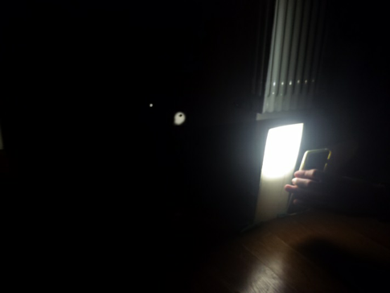

# Come si propaga la luce?

## Obiettivo

L’obiettivo di questo esperimento è analizzare il comportamento della luce.

## Materiali

- Sorgente luminosa (torcia)
- Tre cartoncini scuri (dimensioni: circa 15x20)
- Mollette
- Schermo parete

## Procedimento

1. Forare due cartoncini alla stessa altezza.
2. Disporre verticalmente i cartoncini con le mollette e allinearli davanti ad uno schermo/ parete (al buio), in modo che puntando la luce sui fori essa arrivi sullo schermo.
3. Successivamente porre il terzo cartoncino tra i primi due cartoncini e lo schermo, verificando cosa accade.
4. Forare il terzo cartoncino in modo che allineandolo con gli altri due, la luce raggiunga la parete.

## Foto esperimento

## Osservazioni

Illuminando i fori quando sono presenti solo due cartoncini, noto che la luce emessa dalla torcia attraversa entrambi i buchi effettuati fino ad arrivare allo schermo/parete. La luce sulla parete ha una forma circolare, congruente con il foro del secondo cartoncino (quello più vicino allo schermo).
Quando pongo, tra i due cartoncini forati, il terzo, non forato, noto che la luce non raggiunge più la parete né il foro del secondo cartoncino, poiché viene “fermata” da quest’ultimo. Osservo anche che la luce, quando arriva al terzo cartoncino che la blocca, possiede una forma e delle dimensioni identiche a quelle del foro del primo cartoncino.

## Conclusioni

Affinché sia possibile vedere la luce sulla parete, bisogna disporre i tre cartoncini in modo parallelo tra loro e assicurarsi che i loro fori siano disposti lungo la stessa retta (sulla quale deve essere presente, prima dei cartoncini, anche la sorgente luminosa), poiché i fotoni (le particelle che compongono la luce) si propagano nello spazio in linea retta.
Il terzo cartoncino, quando posto tra gli altri due, “blocca” la luce perché è un corpo opaco, quindi i fotoni non riescono ad attraversarlo.
