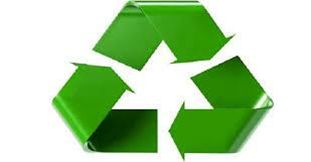
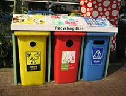

# Rifiuti

[[toc]]

## Cosa sono i rifiuti

I rifiuti sono tutto quello che risulta di scarto o avanzo dalle più svariate attività umane. Spesso noi riusciamo solo a vedere i rifiuti della nostra pattumiera e non ci sembrano preoccupanti, ma in realtà questi rappresentano un serio problema per il Pianeta.

In natura non esiste il concetto di rifiuto: nei cicli biologici, infatti, ciò che viene scartato da un organismo diventa una risorsa per altri esseri viventi, così che nulla viene sprecato ma tutto si trasforma.

Nelle società contadine, l'uomo si comportava in modo molto simile alla natura, poi l'avvento della rivoluzione industriale e l'aumento dei beni immessi nelle società, ha determinato anche un aumento del consumo e, quindi, un aumento dei rifiuti. Questi non sono solo organici come quelli della società preindustriale, ma sono anche inorganici (come, ad esempio, la plastica) e spesso rimangono nell'ambiente molto tempo. Questo implica due cose che i rifiuti vengono generati:

- da noi durante le nostre attività quotidiane;
- dalle industrie che producono le cose che noi consumiamo per vivere.

### Classificazione dei rifiuti

I rifiuti vengono classificati in base all’origine:

- rifiuti urbani (domestici)
- rifiuti speciali derivanti da attività agro-industriali o di demolizione

I rifiuti vengono classificati in base la loro pericolosità:

- rifiuti pericolosi: costituiti da elevate dosi di sostanze pericolose e che quindi devono essere gestiti diversamente dal flusso dei rifiuti urbani normali (per esempio i medicinali scaduti e le pile)
- rifiuti non pericolosi: ovvero i rifiuti generati dalle attività produttive che contengono al loro interno un’elevata dose di sostanze inquinanti. Per renderli innocui occorre eseguire trattamenti che riducono la pericolosità.

## La storia dei rifiuti

L’uomo, nel corso del lungo e difficile cammino dagli albori della Storia fino al giorno d’oggi, ha sempre prodotto dei rifiuti. La loro tipologia è cambiata notevolmente col passare del tempo, come il rapporto tra l’essere umano e la spazzatura.

### Preistoria

Durante la Preistoria i rifiuti, composti principalmente dai resti degli animali cacciati e da qualche rudimentale utensile che si era rotto, non erano un problema per l’uomo. Egli, essendo nomade, li abbandonava lungo il suo cammino.

Testimonianza di questi comportamenti è il sito archeologico nei pressi di Isernia: qui è stato ritrovato un accampamento preistorico, attribuito all’*Homo Erectus*. Sono stati rinvenuti, vicino a dei falò allestiti per riscaldarsi e per cuocere del cibo, molti resti di animali che erano stati uccisi durante battute di caccia, come bisonti, elefanti e rinoceronti.

Questi primi rifiuti della storia dell’uomo non avevano un impatto ambientale: si biodegradavano molto facilmente, in poco tempo, senza lasciare traccia.

Nel Neolitico (8.000-5.000 a.C.) la situazione mutò poiché l’essere umano, avendo scoperto l’agricoltura, aveva scelto di intraprendere una vita sedentaria. Grazie al surplus alimentare dovuto alla nuova ed importantissima scoperta, la popolazione aumentò e con essa la produzione di rifiuti. L’uomo, però, non era capace di smaltire tutta questa spazzatura in un modo corretto.

Un esempio è rappresentato dalla città neolitica di Çatalhöyük, situata nell’odierna Turchia. Questo agglomerato urbano raggiunse dimensioni tali da riuscire a contenere, circa 9.000 anni fa, 8 migliaia di abitanti. Tramite degli scavi archeologici si è scoperto che nella cittadina i rifiuti venivano abbandonati lungo le strade o seppelliti in buche nei pressi delle abitazioni. Questo rese le condizioni igieniche pessime: tra gli scheletri rinvenuti sul luogo, ben il 33 per cento di essi, ossia uno su tre, presentano tracce di infezioni batteriche.

Durante l’Età dei Metalli (5.000-1.500 a.C.) l’uomo, con l’avvento della metallurgia, iniziò a produrre i primi rifiuti tossici: polveri, gas e sostanze dannose per la sua salute si liberavano dalla lavorazione dei metalli e si spargevano nell’ambiente circostante.

### Prime Civiltà

Le prime civiltà cercarono di risolvere il problema dei rifiuti, che già abbondavano nei centri urbani.

In alcune città micenee, databili tra il 3.000 ed il 1.000 a.C., sono stati rinvenuti i primi esempi di discariche nella storia dell’umanità. Erano fosse, situate prevalentemente fuori dalle mura dei centri abitati, contenenti rifiuti seppelliti a strati, intervallati da terra. Nei secoli successivi questa pratica si diffuse nelle civiltà circostanti.

Un grande passo tecnologico per lo smaltimento dei rifiuti organici è stato possibile grazie alla civiltà dell’Indo: già nel 2.500 a.C. le città situate lungo il corso del fiume Indo possedevano, al contrario di tutte le altre popolazioni, un’efficiente rete fognaria, alla quale avevano accesso tutte le abitazioni. Il sistema fognario scaricava tutto ciò che raccoglieva nel fiume stesso.

Sistemi fognari erano presenti anche in molte altre civiltà antiche, successive a quella dell’Indo, come Babilonesi, Assiri e Cretesi. Questi ultimi furono i primi a ideare delle fogne costruite completamente in terracotta.

### Antica Grecia

Gli antichi Greci non prestavano molta attenzione alla pulizia delle loro *poleis*, come invece erano soliti fare le altre civiltà. Infatti, i Greci raccoglievano tutti i loro rifiuti in vasi, chiamati *amis*, per poi svuotarli in strada o in canali e fiumi.

Queste pratiche sconsiderate causavano, oltre all’inquinamento di terreni e fiumi (Strabone narra come l’acqua del fiume Eridano non fosse più potabile per tutti i rifiuti che vi erano stati scaricati), una più facile proliferazione delle malattie. Secondo recenti studi la diffusione dell’epidemia di peste che è scoppiata ad Atene nel 430 a.C. è stata particolarmente favorita dalla pessima igiene che regnava nella città.

Sembra che sia stata Atene la prima *Poleis* ad aver provveduto al problema dei rifiuti. Aristotele, nella sua opera *Athenanion politeia* (la Costituzione degli Ateniesi), descrive come la città si era organizzata contro la spazzatura.

Dieci edili, eletti dalla comunità, si occupavano, tra i loro molti compiti, anche di controllare che nessuno gettasse rifiuti nelle strade o entro dieci stadi dalle mura cittadine. Dei particolari schiavi pubblici, i coprologi, mantenevano pulite le strade e trasportavano i rifiuti fuori città; essi erano coordinati dall’astinome, il magistrato responsabile della salute pubblica.

Questo servizio era molto efficiente, al punto che, anche per la sua pulizia, Atene era considerata, nel 380 a.C., la città più bella dell’Ellade.

### Antica Roma

I Romani avevano molto a cuore la pulizia e l’igiene, tanto che costruirono terme, acquedotti, latrine pubbliche e fogne in tutte le zone del loro impero.

La fogna romana più famosa è sicuramente la *Cloaca Maxima*. Si ispira ad alcune opere architettoniche etrusche, dalle quali traeva importanti elementi di costruzione, come l’arco. È stata inaugurata dal re Tarquinio Prisco e tutt’oggi funziona ancora. All’epoca attraversava tutta l’Urbe e raccoglieva i rifiuti organici delle abitazioni più basse, come le *domus* (non riusciva a garantire un ottimo funzionamento nelle *insulae*, per la loro altezza). Anche se era solo una fognatura, la Cloaca venne utilizzata per smaltire ogni tipo di rifiuto, anche cadaveri (il corpo dell’imperatore Eliogabalo venne gettato in questa fogna nel 222 d.C.).

Gli abitanti delle *insulae*, sprovviste di collegamenti fognari, gettavano i rifiuti dalle finestre; in alcuni casi raccoglievano la spazzatura organica in un locale apposito (solitamente posto alla fine delle scale che permettevano di salire ai piani superiori) per poi utilizzarla per concimare i campi.

A Roma, già dal III sec a.C., la pulizia delle strade era garantita da *edili* (magistrati dello Stato), i quali coordinavano gli *scoparii* (i pulitori di sterco), che raccoglievano i rifiuti e li portavano in discariche situate a debita distanza dalle mura cittadine. Gli *scoparii*, dopo l’editto di Eraclea emanato da Giulio Cesare, erano pagati sia dai privati che dalle autorità e spesso erano assunti grazie ad appalti pubblici.

La pulizia delle latrine pubbliche era effettuata dai conciatori di pelli poiché dall’urina ricavavano ammoniaca, necessaria per il loro lavoro. A loro Vespasiano impose una tassa.

Le discariche romane erano chiamate *puticuli*. In essi venivano lasciati rifiuti di ogni tipo e corpi di gladiatori uccisi nei giochi e schiavi morti. Una discarica molto particolare è Monte Testaccio: durante il periodo romano l’eccessivo accumulo di cocci (*testæ* in latino) in un *puticulo*, tale da formare una collinetta alta circa 45 metri sopra il livello del suolo. 

A Roma ed in tutto l’Impero Romano, nel corso della sua lunga storia, sono stati emanati molti editti per rendere sempre più pulite le città e smaltire in modo regolare i rifiuti. 

Gli imperatori che si dimostravano molto attenti nel mantenere la pulizia delle città venivano investiti del titolo di *Curator*.

### Medioevo

Durante il Medioevo l’uomo ha abbandonato gli efficienti sistemi di smaltimento dell’Impero Romano, come le fogne, i puticuli e le leggi sul trattamento dei rifiuti.
Le città, nel periodo precedente all’anno Mille, caddero in una situazione di degrado: nelle piazze venivano lasciati pascolare animali e i rifiuti venivano semplicemente gettati dalle finestre.

Dei maiali venivano lasciati pascolare liberi per le vie: erano l’unico sistema di pulizia stradale. Questi animali però producevano altri rifiuti ed erano anche pericolosi: sembra che uno di essi abbia causato la caduta da cavallo del figlio del re Luigi il Grosso, nel 1131 d.C. i traumi avrebbero poi portato il giovane alla morte.

Il degrado ha causato un notevole peggioramento delle condizioni igieniche. Ciò ha portato a tremende epidemie, come quella di peste, scaturita negli anni ’30 del XIV secolo (questa pestilenza ha ucciso un terzo della popolazione europea).

Dopo l’anno Mille molte autorità promulgarono leggi per limitare l’abbandono incontrollato dei rifiuti, ma senza successo. Venne iniziata in questo periodo un’opera di ripristino e ricostruzione delle fognature, ma le nuove costruzioni erano scadenti.

### Rinascimento e secoli successivi

Nel Rinascimento e nei secoli successivi il rapporto tra uomo e rifiuti non è cambiato: le strade erano spesso sporche e colme di spazzatura e le condizioni igieniche precarie. Molti governi locali tentarono di imporre leggi contro il parziale degrado dei centri abitati, confidando nella collaborazione dei cittadini. Queste ordinanze riuscirono ad arginare temporaneamente il problema. 

In questo periodo quasi tutti gli edifici dispongono di pozzi neri, dove vengono gettati vari tipi di immondizia, dalle feci fino al materiale tessile.

Nel XVI secolo a Milano vennero introdotti addetti alla pulizia dei pozzi neri e alla raccolta dei rifiuti lasciati lungo le strade. Questi operatori erano chiamati *navazzari* (da *navazza*, il particolare carro che utilizzavano). Tutto ciò che raccoglievano veniva portato fuori città. Nonostante il lavoro di queste persone, esso non fu sufficiente a smaltire tutti i rifiuti e le condizioni igieniche della città non migliorarono.

Anche Roma si attrezzò con un sistema di pulizia della città: nel 1617 una trentina di spazzini sono incaricati della pulizia dell’Urbe. Svolgono il loro incarico regolarmente, specialmente se il Papa deve uscire. Ai cittadini del centro abitato viene imposta una tassa per la pulizia della città.

In Inghilterra nel 1596 avviene un’invenzione fondamentale: John Harington sviluppa il vaso sanitario, l’antenato della nostra toilette. Esso permetteva uno smaltimento dei rifiuti organici molto più veloce ed efficiente.

### ‘700 e ‘800: le Rivoluzioni Industriali

Le due Rivoluzioni Industriali, avvenute nel XIII e nel XIX secolo, hanno cambiato radicalmente la vita dell’uomo. Grazie a nuove invenzioni, come la macchina a vapore o il telaio meccanico, il lavoro dell’essere umano è stato reso meno difficile. In questo periodo nascono le prime industrie.

Molta gente dalle campagne si trasferiva in città, con la speranza di trovare un lavoro nelle nuove fabbriche. Questa “migrazione interna” portò ad un sovrappopolamento incontrollato dei centri abitati, che causò un improvviso aumento dei rifiuti e un calo del livello di igiene cittadina.

Le città europee vissero in un clima malsano fino alla metà del XIX secolo quando tutte si dotarono di un’ampia rete di spazzini per mantenere pulite le strade dalla sporcizia. Sempre in questo periodo iniziò la costruzione di nuove fogne, che verranno ultimate solo verso l’inizio del XX secolo. Nel 1775 Alexander Cummings perfezionò il W.C. di John Harington, inventando il primo water a sifone nella storia dell’umanità. Esso permise, grazie alla sua diffusione piuttosto rapida, uno smaltimento dei rifiuti organici migliore.

Nei centri urbani si è iniziato a riutilizzare alcuni rifiuti (tessuti per fare la carta, corna di mucca per creare bicchieri…), tanto che nacque una nuova professione: lo straccivendolo, colui che recuperava i rifiuti ancora utilizzabili e li rivendeva.

Grazie al lavoro di spazzini e straccivendoli la quantità di rifiuti nei centri abitati diminuiva: una volta raccolti, venivano accumulati in discariche fuori città. 
 
### Il 1900

Durante l’inizio del XX secolo l’uomo ha abbandonato la cultura contadina del riutilizzo. In questo periodo si diffonde la teoria del consumismo, il quale sostiene il concetto usa e getta di oggetti a costo molto basso. La nuova ideologia porta ad un aumento incontrollato della spazzatura.

L’immondizia viene portata fuori città e accumulata in enormi discariche a cielo aperto oppure gettata in mare o nei fiumi. Queste pratiche, nonostante fossero molto dannose per l’ambiente, si sono protratte per decenni.

Nel ‘900 la tipologia dei rifiuti subisce un mutamento: non sono più composti principalmente da materiale organico e naturale, facilmente biodegradabile in poco tempo. Il consumismo favorisce la diffusione di oggetti, come lattine e sacchetti di plastica (inventata nel 1953), con tempi di decomposizione lunghissimi, anche parecchie migliaia di anni.

I nuovi tipi di rifiuti e lo scorretto metodo di smaltimento applicato per molto tempo hanno causato danni gravissimi all’ambiente. Basti pensare soltanto all’isola di spazzatura, più grande dell’Italia, che si è creata nell’Oceano Pacifico.

### La situazione attuale

Nel corso degli ultimi decenni del XX secolo l’uomo, accorgendosi dei danni che la produzione continua e sconsiderata di rifiuti causava all’ambiente, ha capito le gravi conseguenze di uno smaltimento scorretto della spazzatura.

Per contrastare il problema la popolazione mondiale è stata sensibilizzata sull’argomento, favorendo la nascita di una vera e propria coscienza ecologista; inoltre sono state avviate molte politiche ecologiche, anche a livello globale (come la raccolta differenziata).

Molte iniziative a favore dello smaltimento corretto dei rifiuti sono state avviate dagli enti locali, anche se le misure applicate finora non sembrano essere sufficienti.
Molte persone non attuano correttamente la raccolta differenziata o abbandonano con noncuranza la oro spazzatura.

Un altro grave problema è sicuramente quello delle discariche abusive: spesso in mano di clan mafiosi, non smaltiscono i rifiuti in modo corretto (nella maggior parte dei casi vengono bruciati, anche se questa pratica è fortemente dannosa per l’ambiente e per l’uomo). Questo fenomeno è particolarmente diffuso nella Terra dei Fuochi, ma gravi problemi on la raccolta e lo smaltimento dei rifiuti si sono recentemente registrati anche nella città di Roma.

È triste constatare come i rifiuti si trasformino talvolta in questioni economiche che dimenticano l’urgenza della salvaguardia dell’ambiente. È necessario che i governi, le regioni, ognuno di noi abbia la forza di accantonare ogni tornaconto economico, agendo correttamente e investendo risorse poiché una corretta gestione dei rifiuti (con i quali dobbiamo convivere) significa una buona salute per l’ambiente e per ciascuno di noi.

## Rifiuti Pericolosi

Si definiscono rifiuti pericolosi quelli contenenti un’alta concentrazione di sostanze inquinanti.
Devono essere necessariamente ridotti e seguono specifici trattamenti per essere resi innocui.

Vi sono diverse categorie di questi rifiuti:

- scarti industriali, come quelli provenienti dalla raffinazione del petrolio, dall’industria fotografica o metallurgica o da altri processi chimici.
- scarti di origine civile come le pile esaurite ed i medicinali scaduti.
- a rischio infettivo, generalmente di tipo sanitario, come i materiali provenienti da ambienti di isolamento infettivo in cui è presente il rischio di trasmissione biologica aerea, o rifiuti di sepoltura e cremazione.
- pericolosi in agricoltura, come oli esauriti prodotti da motori e freni, farmaci ad uso zootecnico, pneumatici usati o materie plastiche.

Questi rifiuti richiedono una particolare attenzione per la raccolta, per il trasporto e lo smaltimento, in base alla loro composizione, quindi al loro pericolo, sono classificati in modo diverso.

Possono essere:

- **HP 1 Esplosivi**: a seguito di una reazione chimica possono sviluppare gas che abbiano una temperatura, una pressione o una velocità pericolosi per persone e cose.

- **HP 2 Comburenti**: se entrano in contatto con l’ossigeno possono provocare la combustione di altri materiali.

- **HP 3 Infiammabili**: possono essere solidi, liquidi, gassosi, reattivi a contatto con l’acqua, autoreattivi o autoriscaldanti.

- **HP 4 Irritanti**: possono provocare irritazioni ad occhi e pelle.

- **HP 5 Nocivi**: possono essere tossici per alcuni organi bersaglio se esposti o inalati.

- **HP 6 Tossici**: possono rivelarsi tossici se bevuti, inalati o iniettati.

- **HP 7 Cancerogeni**: possono causare il cancro.

- **HP 8 Corrosivi**: possono corrodere la pelle

- **HP 9 Infettivi**: possono essere presenti nei microrganismi vitali o tossine che causano malattie all’uomo.

- **HP 10 Teratogeni**: possono nuocere alla fertilità ed alla riproduzione umana.

- **HP 11 Mutageni**: possono portare alla mutazione genetica di una cellula.

- **HP 12 Liberazioni di gas a tossicità acuta**: possono liberare gas tossici se vengono in contatto con acqua o acido.

- **HP 13 Sensibilizzanti**: contengono sostanze sensibilizzanti per la pelle o gli organi respiratori.

- **HP 14 Ecotossici**: sono rischiosi per l’ambiente.

- **HP 15 Rifiuti che possiedono direttamente una di queste caratteristiche di pericolo ma possono manifestarle successivamente**: tutti i rifiuti che potrebbero presentare rischi per l’ambiente in futuro.

Un grande problema di queste tipologie è l’abbandono da parte della specie umana, propriamente definito *littering*.

Secondo quanto disposto dall’articolo 256 comma 2 del Codice penale, a chi trasgredisce il divieto di abbandono viene prevista una multa da 300 € a 3000€, la quale potrebbe raddoppiare se si tratta di abbandono di rifiuti pericolosi.

Questa tipologia prevede lo stoccaggio, cioè l’insieme di attività per lo smaltimento o per il recupero.

Inizialmente vengono posti in un deposito temporaneo, spesso situato nel sito di produzione, che deve comportare la corretta separazione delle diverse categorie; durante tutto il processo di trattamento devono obbligatoriamente prevedere un’etichettatura speciale.

Dopo lo stoccaggio vengono trasportati, con mezzi autorizzati al trasporto dei rifiuti speciali e pericolosi, in appositi impianti di recupero o smaltimento, a seconda della propria natura e della pericolosità.

## La Sostenibilità Ambientale

Il nostro pianeta non ha risorse all’infinito, per questo bisogna averne cura per rispettare un bene che appartiene a tutti noi e, particolarmente, alle generazioni future.

La sostenibilità ambientale inizia dalle piccole cose quotidiane, che ognuno può e dovrebbe svolgere, per aiutare il nostro pianeta:

- Fare la raccolta differenziata, ma bisogna soprattutto ridurre la quantità d’immondizia prodotta, con stili di vita più attenti e consapevoli.
- Non bisogna sprecare cibo e acqua, ad esempio si dovrebbe chiudere il rubinetto dell’acqua mentre ci si lava i denti.
- Andare a fare la spesa senza prendere la borsa al negozio, ma portarsela direttamente da casa, come borse di tela.
- Usare, quando è possibile, carta riciclata.

*La Terra è una sola e non possiamo più permetterci di rovinarla ulteriormente, bisogna averne rispetto.*
