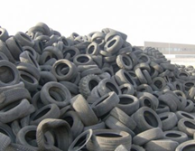
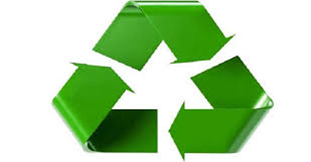
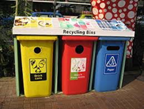

# RIFIUTI PERICOLOSI

## Che cosa sono i rifiuti pericolosi

Si definiscono rifiuti pericolosi quelli contenenti un’alta concentrazione di sostanze inquinanti.
Devono essere necessariamente ridotti e seguono specifici trattamenti per essere resi innocui.

Vi sono diverse categorie di questi rifiuti:

- scarti industriali, come quelli provenienti dalla raffinazione del petrolio, dall’industria fotografica o metallurgica o da altri processi chimici. 
- scarti di origine civile come le pile esaurite ed i medicinali scaduti.   
- a rischio infettivo, generalmente di tipo sanitario, come i materiali provenienti da ambienti di isolamento infettivo in cui è presente il rischio di trasmissione biologica aerea, o rifiuti di sepoltura e cremazione.
- pericolosi in agricoltura, come oli esauriti prodotti da motori e freni, farmaci ad uso zootecnico, pneumatici usati o materie plastiche.

Questi rifiuti richiedono una particolare attenzione per la raccolta, per il trasporto e lo smaltimento, in base alla loro composizione, quindi al loro pericolo, sono classificati in modo diverso.

Possono essere:

- **HP 1 Esplosivi**: a seguito di una reazione chimica possono sviluppare gas che abbiano una temperatura, una pressione o una velocità pericolosi per persone e cose.

- **HP 2 Comburenti**: se entrano in contatto con l’ossigeno possono provocare la combustione di altri materiali.

- **HP 3 Infiammabili**: possono essere solidi, liquidi, gassosi, reattivi a contatto con l’acqua, autoreattivi o autoriscaldanti.

- **HP 4 Irritanti**: possono provocare irritazioni ad occhi e pelle.

- **HP 5 Nocivi**: possono essere tossici per alcuni organi bersaglio se esposti o inalati.

- **HP 6 Tossici**: possono rivelarsi tossici se bevuti, inalati o iniettati.

- **HP 7 Cancerogeni**: possono causare il cancro.

- **HP 8 Corrosivi**: possono corrodere la pelle

- **HP 9 Infettivi**: possono essere presenti nei microrganismi vitali o tossine che causano malattie all’uomo.

- **HP 10 Teratogeni**: possono nuocere alla fertilità ed alla riproduzione umana.

- **HP 11 Mutageni**: possono portare alla mutazione genetica di una cellula.

- **HP 12 Liberazioni di gas a tossicità acuta**: possono liberare gas tossici se vengono in contatto con acqua o acido.

- **HP 13 Sensibilizzanti**: contengono sostanze sensibilizzanti per la pelle o gli organi respiratori.

- **HP 14 Ecotossici**: sono rischiosi per l’ambiente.

- **HP 15 Rifiuti che possiedono direttamente una di queste caratteristiche di pericolo ma possono manifestarle successivamente**: tutti i rifiuti che potrebbero presentare rischi per l’ambiente in futuro.

Un grande problema di queste tipologie è l’abbandono da parte della specie umana, propriamente definito *littering*.

Secondo quanto disposto dall’articolo 256 comma 2 del Codice penale, a chi trasgredisce il divieto di abbandono viene prevista una multa da 300 € a 3000€, la quale potrebbe raddoppiare se si tratta di abbandono di rifiuti pericolosi.

Questa tipologia prevede lo stoccaggio, cioè l’insieme di attività per lo smaltimento o per il recupero.

Inizialmente vengono posti in un deposito temporaneo, spesso situato nel sito di produzione, che deve comportare la corretta separazione delle diverse categorie; durante tutto il processo di trattamento devono obbligatoriamente prevedere un’etichettatura speciale.

Dopo lo stoccaggio vengono trasportati, con mezzi autorizzati al trasporto dei rifiuti speciali e pericolosi, in appositi impianti di recupero o smaltimento, a seconda della propria natura e della pericolosità.

## La Sostenibilità Ambientale

Il nostro pianeta non ha risorse all’infinito, per questo bisogna averne cura per rispettare un bene che appartiene a tutti noi e, particolarmente, alle generazioni future. 

La sostenibilità ambientale inizia dalle piccole cose quotidiane, che ognuno può e dovrebbe svolgere, per aiutare il nostro pianeta:

- Fare la raccolta differenziata, ma bisogna soprattutto ridurre la quantità d’immondizia prodotta, con stili di vita più attenti e consapevoli.
- Non bisogna sprecare cibo e acqua, ad esempio si dovrebbe chiudere il rubinetto dell’acqua mentre ci si lava i denti.
- Andare a fare la spesa senza prendere la borsa al negozio, ma portarsela direttamente da casa, come borse di tela.
- Usare, quando è possibile, carta riciclata.

*La Terra è una sola e non possiamo più permetterci di rovinarla ulteriormente, bisogna averne rispetto.*

## *Made by Diego Sist with ❤️*
